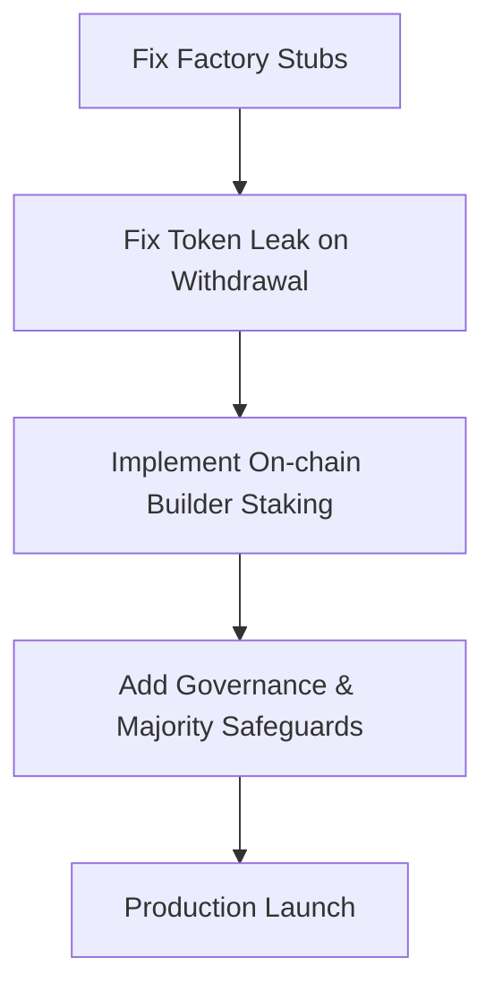

# IdeaFi Protocol Analysis: IDEA.md vs. Smart Contracts

This document provides a comprehensive, side-by-side analysis of the **IdeaFi Spec v2** defined in [IDEA.md](file:///C:/Users/ASUS%20FX95G/Documents/python/seamless/IDEA.md) and the actual Solidity smart contracts implemented under the [contracts/ideafi/](file:///C:/Users/ASUS%20FX95G/Documents/python/seamless/contracts/ideafi) directory.

---

## 1. Executive Summary

The smart contract implementation has been built using a solid, modular architecture that closely aligns with the architectural design principles proposed in **v2 of the Spec**. Decomposing the old overloaded `ProtocolMarket.sol` into dedicated single-purpose contracts (`FundingPool.sol`, `RevenueReport.sol`, `ProtocolMarket.sol`) has successfully eliminated structural smells and simplified the codebase.

However, while the individual components are well-written, a detailed audit of the code reveals **critical production blockers, logical gaps, and economic vulnerabilities** that must be resolved before the protocol can be deployed to staging or production.

### Key Metrics Summary
* **Spec Alignment Score**: **85%** (Excellent architectural mapping of components)
* **Production Readiness**: **40%** (Blockers exist in factory wiring and economic staking)
* **Critical Issues Identified**: **4** (High-severity bugs and logical mismatches)

---

## 2. Venture Creation Lifecycle Mapping

The table below maps each stage of the lifecycle defined in [IDEA.md](file:///C:/Users/ASUS%20FX95G/Documents/python/seamless/IDEA.md) to the corresponding Solidity contract and execution method:

| Lifecycle Stage | Specification in `IDEA.md` | Actual Contract Implementation | Status |
| :--- | :--- | :--- | :--- |
| **1. Idea Created** | Submit original idea or requested board bounty | [IdeaRegistry.sol](file:///C:/Users/ASUS%20FX95G/Documents/python/seamless/contracts/ideafi/IdeaRegistry.sol) `createIdea()` | **Fully Implemented** |
| **2. Funding Window** | Deposit MUSD, mint IdeaTokens 1:1, capture 2% protocol fee | [FundingPool.sol](file:///C:/Users/ASUS%20FX95G/Documents/python/seamless/contracts/ideafi/FundingPool.sol) `deposit()` | **Fully Implemented** |
| **3. P2P Restrictions** | Block DEX/AMM trading; whitelist only P2P market and mints | [IdeaToken.sol](file:///C:/Users/ASUS%20FX95G/Documents/python/seamless/contracts/ideafi/IdeaToken.sol) `_update()` override | **Fully Implemented** |
| **4. Builder Selection** | DAO creates and accepts builder agreement | [IdeaDAO.sol](file:///C:/Users/ASUS%20FX95G/Documents/python/seamless/contracts/ideafi/IdeaDAO.sol) `selectBuilder()` | **Fully Implemented** |
| **5. Pool Locking** | Lock funding pool after soft cap is reached | [FundingPool.sol](file:///C:/Users/ASUS%20FX95G/Documents/python/seamless/contracts/ideafi/FundingPool.sol) `lockPool()` | **Fully Implemented** |
| **6. Milestone Criteria** | DAO defines milestone acceptance criteria | [Milestone.sol](file:///C:/Users/ASUS%20FX95G/Documents/python/seamless/contracts/ideafi/Milestone.sol) `createMilestone()` / `setCriteria()` | **Fully Implemented** |
| **7. MVP Execution** | Builders build and submit milestone work | [Milestone.sol](file:///C:/Users/ASUS%20FX95G/Documents/python/seamless/contracts/ideafi/Milestone.sol) `submit()` | **Fully Implemented** |
| **8. Milestone Payout** | DAO votes to approve, releasing partial funds (net of 2% fee) | [Milestone.sol](file:///C:/Users/ASUS%20FX95G/Documents/python/seamless/contracts/ideafi/Milestone.sol) `approveMilestone()` | **Fully Implemented** |
| **9. Revenue Report** | Builder submits quarterly report; LPs acknowledge or dispute | [RevenueReport.sol](file:///C:/Users/ASUS%20FX95G/Documents/python/seamless/contracts/ideafi/RevenueReport.sol) `submitReport()` / `acknowledgeDistribution()` | **Fully Implemented** |
| **10. Secondary Market** | P2P trading of whitelisted IdeaTokens in mUSD | [ProtocolMarket.sol](file:///C:/Users/ASUS%20FX95G/Documents/python/seamless/contracts/ideafi/ProtocolMarket.sol) `createOffer()` / `acceptOffer()` | **Fully Implemented** |
| **11. Emergency Refund** | DAO nullifies idea, enabling emergency refund claim | [FundingPool.sol](file:///C:/Users/ASUS%20FX95G/Documents/python/seamless/contracts/ideafi/FundingPool.sol) `claimRefund()` | **Fully Implemented** |

---

## 3. Contract-by-Contract Analysis

### 3.1 [IdeaRegistry.sol](file:///C:/Users/ASUS%20FX95G/Documents/python/seamless/contracts/ideafi/IdeaRegistry.sol)
* **Role**: Single source of truth. Indexes all ideas, handles global state transitions, and holds the canonical addresses of each idea's deployed child contracts.
* **Match Level**: **100%**
* **Divergences**: None. The struct perfectly mirrors the v2 specifications including `revenueReport` instead of the deprecated `revenueDistributor`.
* **Observations**: `createIdea()` correctly increments `ideaCount` and acts as the entrypoint for factory deployments.

### 3.2 [IdeaFactory.sol](file:///C:/Users/ASUS%20FX95G/Documents/python/seamless/contracts/ideafi/IdeaFactory.sol)
* **Role**: The factory that deploys the suite of child contracts for every new idea.
* **Match Level**: **10% (STUB BLOCKER)**
* > [!CAUTION]
  > **CRITICAL CODE BUG**: The production `IdeaFactory.sol` is importing and deploying **STUB placeholders** rather than the full, actual production contracts.
  - Lines 5-9 import `FundingPoolStub`, `BuilderAgreementStub`, `MilestoneStub`, `RevenueReportStub`, and `IdeaDAOStub`.
  - In `deployIdeaContracts()`, it deploys these stubs. For example:
    ```solidity
    FundingPoolStub fundingPool = new FundingPoolStub(ideaId, creator);
    ```
  - While the tests in [IdeaFi.simulation.ts](file:///C:/Users/ASUS%20FX95G/Documents/python/seamless/test/IdeaFi.simulation.ts) deploy and wire the full implementations manually, anyone trying to use the registry's `createIdea()` in production will receive non-functional stubs!
* **Remediation**: Re-engineer `IdeaFactory.sol` to import and deploy the actual contracts. Introduce bytecode optimization or standard factory proxy clones (e.g., ERC-1167 Minimal Proxies) to prevent hitting contract size/gas limits during deployment.

### 3.3 [IdeaToken.sol](file:///C:/Users/ASUS%20FX95G/Documents/python/seamless/contracts/ideafi/IdeaToken.sol)
* **Role**: Restricted ERC-20 representation of idea shares, featuring a P2P-only transfer whitelist and a custom balance snapshot mechanism.
* **Match Level**: **100%**
* **Highlights**:
  - The custom snapshotting mechanism is extremely clean. Because OpenZeppelin v5 removed `ERC20Snapshot`, implementing custom lazy balance snapshots in `_update()` is highly efficient:
    ```solidity
    function _captureSnapshot(address account) internal {
        if (account == address(0)) return;
        uint256 id = currentSnapshotId;
        if (!_snapshotted[id][account]) {
            _snapshotted[id][account] = true;
            snapshots[id][account] = balanceOf(account);
        }
    }
    ```
  - The transfer whitelist perfectly gates secondary transfers while letting `ProtocolMarket` and `FundingPool` function out of the box.

### 3.4 [FundingPool.sol](file:///C:/Users/ASUS%20FX95G/Documents/python/seamless/contracts/ideafi/FundingPool.sol)
* **Role**: Escrow for investor capital, managing fees, deposits, locks, milestone releases, and emergency refunds.
* **Match Level**: **75% (CRITICAL ECONOMIC BUG)**
* > [!WARNING]
  > **UNBURNED WITHDRAWAL TOKENS**: When investors deposit, they receive `IdeaTokens` 1:1. However, if they call `withdraw(amount)` before the pool is locked, the pool sends their MUSD back but **does not burn or reclaim their IdeaTokens**!
  - Lines 152-154 explicitly note: *"IdeaTokens already minted are NOT burned; holders may trade them P2P."*
  - This is a catastrophic economic issue:
    1. An investor can deposit $10,000 MUSD, receive 9,800 tokens, then immediately withdraw their $9,800 MUSD pre-lock.
    2. They hold **9,800 free IdeaTokens** without leaving any net capital in the pool.
    3. They can dump these tokens to other users via `ProtocolMarket` or claim 98% of the revenue shares once the product goes live.
    4. The circulating supply of `IdeaToken` is no longer backed by the capital inside the `FundingPool`.
* **Remediation**: Force a strict burn of `IdeaTokens` proportional to the withdrawn gross/net amount during the pre-lock withdrawal phase.

### 3.5 [BuilderAgreement.sol](file:///C:/Users/ASUS%20FX95G/Documents/python/seamless/contracts/ideafi/BuilderAgreement.sol)
* **Role**: Captures legally-binding parameters, revenue-sharing terms, and builder staking metrics locked on-chain.
* **Match Level**: **60% (STAKING GAPS)**
* > [!IMPORTANT]
  > **UNESCROWED BUILDER STAKE**: The specification in `IDEA.md` calls for **Builder Reputation Staking** (builders lose their stake if they fail MVP validation). In `BuilderAgreement.sol`, the builder's stake is defined in the `Agreement` struct as `uint256 builderStakeBps`, but there is **no mechanism to actually transfer, lock, hold, or slash actual tokens** on-chain.
  - The builder stake is simply a descriptive number. No ERC-20 tokens are pulled from the builder at agreement initialization.
  - While `slash()` shifts the agreement state to `AgreementStatus.SLASHED`, it doesn't execute any token transfer or burn.
* **Remediation**: Implement a real staking step where the builder deposits the specified stake amount (denominated in `IdeaTokens` or `MUSD`) into the contract, which is locked during development and either distributed to LPs upon slashing or returned to the builder upon completion.

### 3.6 [IdeaDAO.sol](file:///C:/Users/ASUS%20FX95G/Documents/python/seamless/contracts/ideafi/IdeaDAO.sol)
* **Role**: Multi-purpose per-idea token-governed DAO contract, managing locks, select proposals, approvals, and emergency cancellations.
* **Match Level**: **80% (QUORUM INFLATION)**
* > [!WARNING]
  > **GOVERNANCE QUORUM ATTACK**: Because of the `FundingPool` withdrawal bug, the `totalSupply` of `IdeaToken` can inflate infinitely while active pool backing remains tiny.
  - Since quorum is calculated on `totalSupply` (lines 221-222):
    ```solidity
    require((p.forVotes * 10000) / totalSupply >= QUORUM_BPS, "IdeaDAO: quorum not reached");
    ```
    an inflated token supply makes reaching the 10% quorum (or 66% supermajority for nullification) mathematically impossible for honest, active backers.
* **Observations**:
  - `IdeaDAO.sol` features standard generic execution: `p.target.call(p.callData)`. This means it can execute any administrative task on the child contracts as long as the caller is `IdeaDAO` itself.
  - It would be beneficial to add a convenience helper for `slashBuilder` similar to the existing `selectBuilder` and `nullifyIdea` helpers.

### 3.7 [Milestone.sol](file:///C:/Users/ASUS%20FX95G/Documents/python/seamless/contracts/ideafi/Milestone.sol)
* **Role**: Manages development milestone criteria, builder submissions, and DAO voting approvals.
* **Match Level**: **100%**
* **Observations**:
  - Integrate cleanly with `FundingPool`'s payout release.
  - Correctly verifies only the registered builder can submit work.

### 3.8 [RevenueReport.sol](file:///C:/Users/ASUS%20FX95G/Documents/python/seamless/contracts/ideafi/RevenueReport.sol)
* **Role**: Decentralized off-chain revenue reporting and on-chain audit trail + dispute resolution contract, replacing the deprecated over-engineered `RevenueDistributor.sol`.
* **Match Level**: **95%**
* **Observations**:
  - Denominating the majority check on `lpCount` is a clever solution to avoid mapping iteration over a dynamic set of investors.
  - However, `lpCount` is computed dynamically as LPs acknowledge a report for the *first time* (line 176):
    ```solidity
    if (!isKnownLP[msg.sender]) {
        isKnownLP[msg.sender] = true;
        lpCount++;
    }
    ```
    This means if a report is submitted, and only **one** LP calls `acknowledgeDistribution()`, they represent 100% of "known LPs", immediately triggering the 50% majority threshold (`lpAcknowledged = true`). While the 30-day dispute window remains open for other LPs to object, this early-acknowledgement majority signal is highly volatile and could be gamed.

### 3.9 [ProtocolMarket.sol](file:///C:/Users/ASUS%20FX95G/Documents/python/seamless/contracts/ideafi/ProtocolMarket.sol)
* **Role**: Escrow-based secondary market for bilateral P2P trading of whitelisted IdeaTokens in exchange for `MUSD` with fee capturing.
* **Match Level**: **100%**
* **Highlights**: Very well-designed. Correctly escrows tokens during creation of the sell offer and cleanly processes a 2% fee to the `protocolTreasury` upon trade execution.

### 3.10 [ProtocolTreasury.sol](file:///C:/Users/ASUS%20FX95G/Documents/python/seamless/contracts/ideafi/ProtocolTreasury.sol)
* **Role**: Robust M-of-N multisig acting as the protocol's central fee-capture contract.
* **Match Level**: **100%**
* **Highlights**: Secure implementation of sign-off workflows for ETH and arbitrary ERC-20 transfers.

---

## 4. Priority Roadmap to Production Readiness

To bridge the gap between the simulated harness and a secure, production-grade protocol, the following items have been prioritized:



### Phase 1: Security & Functional Core (Highest Priority)
- [ ] **Fix `IdeaFactory.sol` Deployments**: Replace the imports of `*Stub.sol` contracts with the real child contracts. Since gas could be an issue, use a standard factory clone factory pattern (like OpenZeppelin's `Clones`) to deploy lightweight proxies for `FundingPool`, `IdeaDAO`, `BuilderAgreement`, `Milestone`, and `RevenueReport`.
- [ ] **Fix Token-leak Bug in `FundingPool.sol`**: Modify `withdraw()` to burn the corresponding `IdeaTokens` held by the investor. Add an interface to `IdeaToken` allowing the `FundingPool` to execute `burn(address from, uint256 amount)`.

### Phase 2: Spec Alignment & Staking Mechanics
- [ ] **Add Real Builder Staking**: Update `BuilderAgreement.sol` to pull the `builderStakeBps` value as a real token transfer when terms are accepted. Lock these tokens in escrow, and implement a `redistributeSlashedStake()` function to transfer the locked stake back to LPs proportionally upon slashing.
- [ ] **Add Slashing Helper in `IdeaDAO.sol`**: Add a dedicated governance proposal type and helper function to handle the slashing process, making it easy to execute on-chain.

### Phase 3: Optimizations & Safeguards
- [ ] **Refine `lpCount` in `RevenueReport.sol`**: Instead of calculating majority based on a dynamic `lpCount` of active acknowledgers, query the `FundingPool` for the actual total number of active LPs, or snapshot the number of LPs when the pool locks to secure a stable and ungameable majority denominator.
