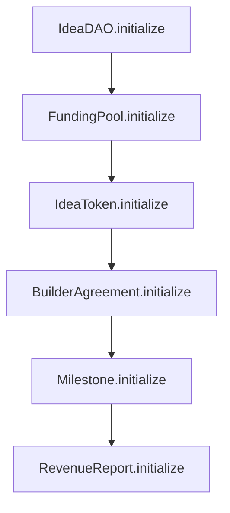

# IdeaFi Upgrade: Minimal Proxies & Burn-on-Withdrawal Flow Spec

This document details the operational flow, initialization sequencing, and critical edge cases for the upcoming upgrade of the **IdeaFi Protocol**. 

The upgrade implements:
1. **ERC-1167 Minimal Proxies (Clones)** via OpenZeppelin's `Clones` library to reduce child contract deployment costs by ~90%.
2. **Strict Burn-on-Withdrawal** to eliminate capital double-spending, token supply dilution, and governance quorum manipulation.
3. **No Builder Staking**: Builders do not lock or stake assets on-chain, keeping the onboarding overhead minimal.

---

## 1. Upgraded Contract Architecture

Because ERC-1167 minimal proxies use `delegatecall` to forward all execution to a master implementation copy, clones **cannot** run constructor logic. We replace constructors with `initialize(...)` functions protected by the `initializer` modifier from OpenZeppelin's `Initializable`.

### 1.1 Custom `SimpleOwnable`
To bypass constructor dependency issues in OpenZeppelin's standard `Ownable`, we implement a clone-compatible `SimpleOwnable` contract:

```solidity
abstract contract SimpleOwnable {
    address private _owner;
    
    event OwnershipTransferred(address indexed previousOwner, address indexed newOwner);
    
    function owner() public view virtual returns (address) {
        return _owner;
    }
    
    modifier onlyOwner() {
        require(owner() == msg.sender, "SimpleOwnable: caller is not the owner");
        _;
    }
    
    function _initializeOwner(address initialOwner) internal {
        require(_owner == address(0), "SimpleOwnable: already initialized");
        _owner = initialOwner;
        emit OwnershipTransferred(address(0), initialOwner);
    }
    
    function transferOwnership(address newOwner) public virtual onlyOwner {
        require(newOwner != address(0), "SimpleOwnable: new owner is the zero address");
        emit OwnershipTransferred(_owner, newOwner);
        _owner = newOwner;
    }
}
```

---

## 2. Sequential Initialization Flow

Since child contracts share circular dependencies, `IdeaFactory.sol` creates the full suite of clones in a two-step phase: **1) Clone Creation** followed by **2) Sequential Initialization**.

### Step 1: Clone Creation
The factory creates 6 clean clone addresses:
```solidity
address ideaDAO = Clones.clone(ideaDAOImpl);
address fundingPool = Clones.clone(fundingPoolImpl);
address ideaToken = Clones.clone(ideaTokenImpl);
address builderAgreement = Clones.clone(builderAgreementImpl);
address milestoneContract = Clones.clone(milestoneImpl);
address revenueReport = Clones.clone(revenueReportImpl);
```

### Step 2: Sequential Initialization
The factory invokes `initialize(...)` on each clone to wire them together securely:



1. **`IdeaDAO.initialize(ideaId, registry, ideaToken)`**
2. **`FundingPool.initialize(ideaId, musd, ideaToken, protocolTreasury, registry, softCap, hardCap, deadline, builderAllocationPct)`**
3. **`IdeaToken.initialize(name, symbol, protocolMarket, fundingPool, ideaDAO)`** (initializes `SimpleOwnable` setting owner to `IdeaDAO`)
4. **`BuilderAgreement.initialize(ideaId, registry, fundingPool, protocolTreasury)`**
5. **`Milestone.initialize(ideaId, registry, fundingPool)`**
6. **`RevenueReport.initialize(ideaId, registry, fundingPool)`**

---

## 3. Strict Burn-on-Withdrawal Flow

To secure the pool's economic integrity pre-lock, the withdrawal process forces a strict 1:1 burn of `IdeaTokens` relative to the MUSD claimed:

```
[Investor calls FundingPool.withdraw(amount)]
                     ↓
         [Check pool !isLocked]
                     ↓
       [Check deposits[msg.sender] >= amount]
                     ↓
  [Check token.balanceOf(msg.sender) >= amount] ──(Reverts if sold P2P)──> [REVERT]
                     ↓
     [Call token.burn(msg.sender, amount)]
                     ↓
  [Internal State: subtract deposit & total]
                     ↓
   [Transfer gross MUSD refund to investor]
```

---

## 4. Key Edge Cases Analyzed

### Edge Case 4.1: Partial Secondary Sale & Withdrawal Attempt
* **Scenario**: Investor A deposits 1,000 MUSD, receiving 980 `IdeaTokens` (after the 2% fee). Investor A then sells 500 `IdeaTokens` on the secondary market to Buyer B. Investor A subsequently attempts to withdraw the full 980 MUSD from the pool.
* **Operational Flow**:
  1. Investor A calls `withdraw(980)`.
  2. The pool verifies that `deposits[Investor A] >= 980` (Passes).
  3. The pool verifies `ideaToken.balanceOf(Investor A) >= 980`.
  4. Since Investor A only holds 480 tokens (having sold 500), the check **fails** and the transaction **reverts**.
* **Resolution**: Investor A cannot double-spend capital. They can only withdraw up to 480 MUSD (the amount backed by their remaining token balance).

### Edge Case 4.2: Secondary Buyer Withdrawal Attempt
* **Scenario**: Investor A deposits 1,000 MUSD, receives 980 tokens, and sells 500 tokens to Buyer B. Buyer B now holds 500 `IdeaTokens`. Can Buyer B call the pool to withdraw MUSD?
* **Operational Flow**:
  1. Buyer B calls `withdraw(500)`.
  2. The pool verifies `deposits[Buyer B] >= 500`.
  3. Since `deposits[Buyer B]` is `0` (they purchased via secondary market, not direct deposit), the transaction **reverts**.
* **Resolution**: Secondary market buyers cannot drain the pool pre-lock. Capital belongs strictly to the pool to back the development once locked, and pre-lock refunds are only accessible by the original depositors.

### Edge Case 4.3: Implementation Hijacking
* **Scenario**: An attacker calls `initialize()` directly on the master copies (the implementation contracts deployed once for delegating execution) to gain ownership.
* **Operational Flow**:
  1. Master implementation contracts are deployed.
  2. The master contract constructors run once at deployment and call `_disableInitializers()`.
  3. The attacker calls `initialize(...)` on the master copy.
  4. The call reverts because initializers are permanently disabled on the implementation address.
* **Resolution**: State variables of the master copies can never be manipulated, maintaining complete security. Clones remain independent and fully protect their own isolated storage.

### Edge Case 4.4: Governance Quorum & Supply Integrity
* **Scenario**: Multiple LPs deposit and withdraw capital before the pool is locked.
* **Operational Flow**:
  1. Every deposit mints tokens, and every withdrawal destroys tokens 1:1.
  2. Circulating `totalSupply` always perfectly matches active `totalDeposited`.
* **Resolution**: The total voting supply cannot be inflated. This guarantees that `IdeaDAO` quorum calculations remain fair, stable, and completely immune to voting-dilution exploits.
